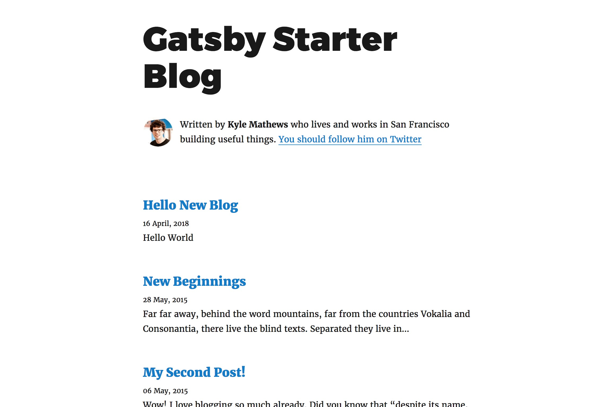

Recently I decided to migrate my blog to [Gatsby](https://www.gatsbyjs.org/). Gatsby is a blazing fast static site generator based on React.

**Why does people love to write on platforms like Medium other than using static site generator?**

There are two kind of people: people who write on platforms like Medium and people who code the blog themselves using static site generators. There are lots of advantages to write on public platforms like Medium over static site generators. If you write in public platforms, you can write on laptop, and edit on your phone, once you finished writing, you just need to click "Publish" button, everything is done and your blog is live, and you can reach your audience right away. On the other hand, if you write a blog in static site generator, you will need to remember all the scripts, preview blog on `localhost`, build the blog for production, commit and push your changes to GitHub and deploy your site to public. If anything goes wrong, you might have to repeat some of the steps and wait a few minutes until the blog online is what you want.

> You will end up spend much more time doing unimportant things other than actual writing.

**Why should I write in Gatsby instead of platforms?**

I guess this is why people eventually give up writing using static site generator and just write on Medium. But there is something Medium or Wordpress can not provide: The more you write, the more you want to keep your writings in a secure place, in simple format, just like you keep your diary books for years. Just imagine that one day you will need to migrate everything you wrote from Medium to somewhere else, that is when you hope you have wrote everything in Markdown initially and have a site hosting those Markdown files.

**But how can I make writing in Gatsby as easy as writing on Medium?**

Writing using static site generator does not need to be difficult. I always believe that the easier you can write and publish a blog, the more you will write. After trying and researching with different setups, and I am pretty happy with the result.

With my setup with Travis, `git push` is the new "Publish" button. All you need to do is to commit and push your code, nothing else is needed. And I will also share on how to edit the blog on your phone.

This post will be divided into five sections:

1.  **Create a Gatsby blog**
1.  **Setup Github Pages to host your blog**
1.  **Setup Travis for Automatic Deployment**
1.  **Add a new blog and publish**
1.  **Bonus: Write blog from your Phone**

## 1. Create a Gatsby blog

There are [plenty](https://scotch.io/tutorials/zero-to-deploy-a-practical-guide-to-static-sites-with-gatsbyjs) of [tutorials](https://www.gatsbyjs.org/tutorial/) on how to setup a blog using Gatsby, and what are the powerful features Gatsby provided, this blog will not be focusing on that, but I will still show some basic steps to get a blog running.

I assume you are already a Javascript developer and know some basic of `npm`, `yarn` and continuous integration. For this tutorial I will be using `yarn` but feel free to use `npm`.

First install `gatsby-cli` and create a new repo using Gatsby's official blog starter.

```sh
$ yarn global add gatsby-cli
$ gatsby new gatsby-blog https://github.com/gatsbyjs/gatsby-starter-blog
$ cd gatsby-blog
$ gatsby develop
```

Now open `localhost:8000` in your browser and you should see the generated blog in your browser.


## 2. Setup Github Pages to host your blog

Now lets host the blog public.

There are plenty of options to host your site for free, but I prefer to put both source code and production code in a single place, since I commit my code to GitHub, I will prefer to host my site using [GitHub Pages](https://pages.github.com), feel free to use other services to host your static site.

> Note: Later I will need to use [Travis](https://travis-ci.org/) to automatically deploy website after each commit, so you might also need to [check which platforms they support](https://docs.travis-ci.com/user/deployment/) for deployment.

Now create a repo named _username.github.io_, this will be the repo of both your source code of your site and the generated production build.

Because GitHub Page serve content from `master` branch, you will need to deploy the content of `public` folder generated by `yarn build` command to `master` branch. We will need to put our source code into another branch, we call it `develop`.

Let's create initial commit and rename the branch to `develop`.

```sh
$ git init
$ git add .
$ git commit -m "Initial Commit"
$ git branch -m develop
```

Now we need to push our code into GitHub. If you have already created the repo named _username.github.io_, now push your code into the GitHub.

```sh
$ git remote add origin git@github.com:username/username.github.io.git
$ git push -u origin develop
```

Make sure there is no `master` branch in your GitHub repo and default branch is set to `develop`.

## 3. Setup Travis for automatic deployment

This is an important step, although we can use `yarn deploy` to deploy, that is another 3 steps: Generate public folder, deploy to GitHub Page, wait and check online.

And we are able to get rid of those steps with [Travis CI](https://travis-ci.org/). Travis CI is a hosted, distributed continuous integration service used to build and test software projects hosted at GitHub.

If your project is public on GitHub, Travis is totally free. Now create a Travis account by connect with your GitHub and add your repo in Travis.

### Create a `travis.yml` file in project root

```yaml
language: node_js
cache:
  directories:
    - ~/.npm
notifications:
  email:
    recipients:
      - chen@huchen.me # Modify here to your own email
    on_success: always
    on_failure: always
node_js:
  - '9'
git:
  depth: 3
script:
  - yarn build # Modify here if your build script is different
deploy:
  provider: pages
  skip-cleanup: true
  keep-history: true
  github-token: $GITHUB_TOKEN
  local-dir: public
  target-branch: master
  on:
    branch: develop
```

Let me explain this config:

* **notifications**: Ask Travis to send me an email on both success and failed build, by default it only send email if status changed (was success but new change failed, or was failed and new changes fixed the build), I want to receive email even if it is success so I could double check online.
* **git:depth:3**: Ask Travis to use depth `3` when cloning the project, it will help to make your build faster.
* **script**: The script Travis need to run is `yarn build`, which create static files in `public` folder for further deployment.
* **deploy**: Ask Travis to deploy to GitHub Pages after `yarn build` script success, it use `$GITHUB_TOKEN` I set in Travis repo setting (I will come to this next), push contents in `public` folder into GitHub `master` branch, and it only should trigger deploy on `develop` branch. Click [here](https://docs.travis-ci.com/user/deployment/pages/) to read more about deploy config.

### Create a token for Travis to push to GitHub

You’ll need to generate a [personal access token](https://help.github.com/articles/creating-an-access-token-for-command-line-use/) with the `public_repo` or `repo` scope (repo is required for private repositories) to allow Travis to push code to our GitHub repo (because Travis run `yarn build` and need to push `public` folder into `master` branch where GitHub Pages is serving).


Once token is created, you will need to **copy and paste it** in your Travis repo settings.


Now add `.travis.yml` in git and push changes to GitHub.

```sh
$ git add .travis.yml
$ git commit -m "Add Travis config file"
$ git push origin develop
```

Now you can check the status on Travis, you should see Travis is status changed to yellow (running), if everything is ok, it will turn green in a few minutes and you should receive an email about the successful build and you can visit `https://username.github.io` to view your blog just created.


## 4. Add a new blog and publish

Here comes the fun part, now I will demonstrate how easy it is to publish a new blog using current process.

Now let's add a new blog.

1.  Create a file `index.md` in `src/pages/new-blog`, you will need to create a new folder `new-blog` as well.
2.  Put some simple content in `index.md`.

```md
---
title: Hello New Blog
date: "2018-04-16T23:46:37.121Z"
---

Hello World
```

3.  Commit this new file and push into GitHub

```sh
$ git add .
$ git commit -m "Add a new blog"
$ git push origin develop
```

4.  Wait for Travis to finish and check online. After you receive an email a few minutes later, now if you check `https://username.github.io` again, you should see your new blog in the list.



## 5. Bonus: Write blog from your phone

I want to remove another barrier of writing blog. I was only able to write blog when I am with my laptop, but can I use my phone to craft ideas and edit?

It turned out to be pretty easy, all you need to do is to [add your Desktop and Documents files to iCloud Drive](https://support.apple.com/en-sg/HT206985) and put your repo either in Desktop or Documents. It may take sometime initially, but once everything is uploaded, the updates is instant and I can view my edits in my laptop, my iPhone and iPad at the same time without any issues.

There are plenty of markdown apps on iPhone, personally I find [IA Writer](https://ia.net/writer) is the best: it supports all platforms; it is elegant and focus on writing; it supports iCloud Drive very well.

Although I can also setup my iPhone to do git commits and pushes, I feel it is not necessary. If the most difficult part of writing a blog is already done, using laptop to do the final checking and commit the code is not a big issue for me, `git push` is just as simple as clicking the "Publish" button on Medium.

## Conclusion

We have come to the end of this tutorial. Thank you for reading this far.

This post is just the tip of iceberg of Gatsby's features, I am really amazed by its flexibility and powerful features. You should definitely checkout its [official tutorial](https://www.gatsbyjs.org/tutorial/).
