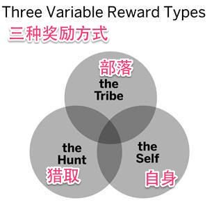

偶然在 Medium 上看到的两篇文章「[Weekly Redesign Challenge](https://medium.com/weekly-redesign-challenge)」和「[How I finally learned Rails](https://medium.com/ruby-on-rails/how-i-finally-learned-rails-95e9b832675b)」给我一些启发，前者是一个在 Shopify 工作的设计师每周重新设计一个手机 App 的交互，后者是一个前端工程师想要学习 Ruby on Rails，于是每周完成一个小软件并做成视频教程放在自己的博客上。他们对自己的挑战也给了我很多激励，让我觉得自己也应该更加专注的做成一些事情。

我对自己的优点和缺点非常清楚，爱尝试新东西，也更爱浅尝辄止；想做很多事，也容易浮躁，没有把一样东西做到极致的持久力。

## 12 周挑战

为了解决这些问题，我决定挑战自己。从这一周开始，每周阅读一本和互联网或者设计相关的英文书。最晚在拜天晚上，把这本书的读书笔记，精华摘要发布在这个专栏里。

## 挑战目的

* 提高单词量。之前看过一本『把你的英语用起来！』，里面推荐一段时间专注地阅读大量英文原著来提高英语单词量的方法，正好可以试一试。
* 系统和更广泛地了解一些领域的内容和观点。Dropbox 的创始人 Drew Houston 在创立 Dropbox 之前的一个大学暑假里大量阅读了很多关于营销和创新方面的书籍，后面 Dropbox 的成功应该和读的这些书籍也有一定的关系。

## 第一本书 『Hooked - How to Build Habit-Forming Products』

> * [亚马逊](www.amazon.com/Hooked-How-Build-Habit-Forming-Products-ebook/dp/B00HJ4A43S) 上 417 个评价，平均 5 星
> * 作者 Nir Eyal 和 Ryan Hoover
> * 第一作者 Nir Eyal 在哈佛和一些 500 强公司教授用户心理学，同时也在 Harward Business Review 以及 Tech Crunch 之类的媒体发表文章。
> * 第二作者 Ryan Hoover 在写完这本书之后不久就 [创立了 Product Hunt](https://medium.com/on-startups/the-artifacts-of-product-hunt-11682e9e01dd)，一个每天播报互联网最新产品的网站，给像 [Yo](https://itunes.apple.com/us/app/yo./id834335592?mt=8) 之类的 App 提供了大量种子用户和曝光率，Product Hunt 去年 10 月拿到了 [A16Z 领投的 A 轮投资](https://a16z.com/2014/10/08/producthunt/)，深受科技产品人士的喜爱，我也是几乎天天刷这个网站，显然我被 hook 住了。（36 氪的 [NEXT](http://next.36kr.com/posts) 上每天也有大量国内外的最新产品）

书里大量心理学的实验是精华，和怪诞心理学很类似，但是这本书更加专注在互联网产品上。书里讲的大部分道理都是似曾相识，或者说自己也想到过的，但是没有系统的把这些道理放在一起，形成一个系统。这本书的精华就是他给你勾画出了一个大框，每章后面还有总结，和一些 Todo List，让创业者们一步步去思考和改进自己的产品。

## 笔记简要

Hooked 可以翻译成对一个产品形成使用习惯，当然，叫勾引也可以 :D

首先关于习惯的一些理论：

* 产品经常先入为主，一个新的产品要想替代一个老产品，需要至少比旧产品好 9 倍。而想要改变用户对一个产品的长期的使用习惯非常非常困难，因为习惯都是 LIFO (Last in First out) 。
* 在一段时间内，越频繁的使用一个产品，越容易形成使用习惯。如果想要让一个不太频繁的行为形成习惯，就得对用户很有用，要么能让用户获得快乐，要么能减轻用户的痛苦。
* 调查显示一个电商如果提供越透明的价格对比信息，用户就越喜欢。（我个人也是喜欢能帮我省时间的产品，哪怕他更贵一点。比如我之前没制作过书，Blurb 的网站上有大量视频和教程，能直接把我从新手带到半专业，最后我也毫无疑问选择 Blurb 来打印我的照片书。[Booking](http://www.booking.com) 上的价格普遍比 [Agoda](https://www.agoda.com) 上的贵一点，但是一旦发现在 Booking 上能最快速的找到我想要的酒店，之后就再也没用过 Agoda 了。）
* 习惯养成区域：在高频和有用两个坐标之间的一条弧线，弧线之上就代表用户能形成习惯。

* 维他命 vs. 止痛片。人人都在提的一个话题，你的产品是维他命（可有可无）还是止痛片（多贵都得买）。很难想象生活中没了 iPhone，或者支付宝是什么样子，一定苦不堪言，所以这些就是止痛片。但是不代表维他命一直就是维他命，他们也有可能变成止痛片，就像作者指出的，Facebook, Twitter, Instagram, Pinterest 这些成功社交产品刚开始都是维他命，但是一旦形成习惯，之后如果某一天在你的生活中忽然消失，你会很难受，他们就变成了止痛片。

作者提出了一个四部的习惯模型：触发，行动，奖励，投资。本书的精华之一。

**触发：**触发分为外在和内在。

广告，邮件，公众账号，微博，软件提醒之类的都是外在触发。外在触发又有 4 种：

1.  Paid Triggers （付费触发）：因为比较贵，一般用来获取新用户和拉回许久不用的用户。
1.  Earned Triggers（获取的触发）：免费，但是需要花费时间。媒体转发，很火的视频，App Store 官方推荐这之类的都是 Earned Triggers。这种触发特点是效果都很短，短期内获取一定的关注马上又都没了。
1.  Relationship Triggers（关系触发）：点赞，口口相传，朋友推荐之类的，这类在社交软件里用的很多。
1.  Owned Triggers（已获取的触发）：显眼的图标，邮件动态，关注的公众平台，App 的提醒这类已安装软件或者已关注的触发。这类触发可以重复地和用户互动，直到用户习惯形成。

要让用户形成习惯，更重要的是内在触发。比如无聊的时候不自觉的刷朋友圈，遇到什么新鲜事马上想发到微博或者 instagram 上。负面情绪是最有效的内在触发，无聊，孤单，烦躁等等的情绪都属于这类，比如实验调查说抑郁的人会花更多时间上网。

找到用户的内在触发和用户情感之间的联系的两种方法：

1.  Jack Dorsey（Twitter 和 Square 创始人） 推荐用人物描述（Persona）。
1.  丰田公司的 Five Why 方法。

**行动：**

一个斯坦福的 Director Fogg 建立了一个行为模型：总结为任何人的任何行为都需要符合三个条件才有可能完成：

1.  用户需要足够的动机去完成这个行为。
1.  用户需要足够的能力去完成这个行为。
1.  用户需要一个触发。

拿接电话这个行为来说，如果你觉得是卖保险的人打来的，你可能不会去接，这是缺乏动机；手机放在包底取不出来，这是没有能力；静音了听不到，没有触发。

Fogg 说人们的动机往往是去寻求快乐，减轻痛苦，寻找希望，避免害怕，寻求社会认同，和避免被拒绝。除了正面情绪，有时候负面情绪也能带来很大动机，比如这个让人们骑车带头盔的广告：

> 因为戴头盔让我看起来很傻，所以我不想带

相信骑摩托车的看到这个广告应该都会带了吧。

关于用户需要足够能力去完成这个行为这一点，对现在的产品尤为重要，写博客和点赞哪个用户更容易去做？这也是互联网从博客时代到微博朋友圈时代变迁的原因。

Fogg 也讲了 6 个影响一个任务困难度的元素：

1.  时间
1.  金钱
1.  体力
1.  脑力活动
1.  社会接受度：大家是不是接受这个行为？
1.  打破正常习惯：会不会打破用户现在已经有的习惯？

然后书里讲了一些常见的例子，比如用 Facebook 登陆，分享到 Twitter，iPhone 的锁屏拍照，Pinterest 的页底加载等等。

那么对于一个产品来说，增加用户的动机和让用户更容易的行动，应该哪个先呢？答案是从让用户更容易的行动开始。因为提高动机太贵太费时间，所以让用户更有能力的做一个行为就会相对容易些。

当然，除了这些比较正常的方法之外，书里还提到一些其他方法：

* The Scarcity Effect 饥饿效应，有两个产品我个人感触很深，而对我非常有效：[Booking](https://www.booking.com) 在选择的时候旁边经常弹出有几个人正在看这间房，上一个预定的人是什么时间，这间房这个时间还有几间，让人感觉再不定马上就没了；另一个是亚马逊的库存数，动不动就只剩十几个了，不得不赶紧下单。
* The Framing Effect. 大概意思就是产品在不同的场景用户会觉得不一样。比如同样的酒放在 90 块钱的瓶子里和 5 块钱的瓶子里，用户会觉得 90 块的好喝。
* The Anchoring Effect. 『怪诞行为学』里的锚，用户喜欢根据一个产品来评估另一个产品。同样的价格，双十一先升一倍价格再打五折还是能大大提高销量。
* The Endowed Progress Effect. 吃完饭给饭店送你盖章的积分卡，盖满可以换取一些奖励，如果送给你一张一共十个位置的卡但是已经盖了两个，或者送你一个一共八个位置的空卡，已经盖了两个章的卡让用户更想要去完成它。

LinkedIn 的用户资料完成度

**奖励：**

为了获得用户的兴趣，产品必须有持续性的新鲜感。（这点 Product Hunt 和 NEXT 就做的非常好）。新鲜感会刺激我们的兴趣，引起我们的注意，人人都喜欢新鲜感。

奖励的种类：Rewards of the Tribe, Hunt, and Self

Tribe（部落）：我们的大脑喜欢让我们觉得自己被接受，有吸引力，很重要，属于一个群体里的奖励。然后书里举例说明了一些社交网络的部落奖励：Facebook 每次刷都不同的新鲜事，点赞给作者的奖励；Stack Overflow 的积分，和每回答一个问题收获积分的不确定性。

Hunt（猎取）：人们喜欢猎取东西，以前是食物，现在是猎取信息。这部分说实话我没太看懂，大意就是 Twitter 和 Pinterest 上面猎取无穷无尽的信息的快感吧。

Self（自己）：完成任务的快感。打游戏升级，用 Mailbox 的时候获得 Inbox Zero 的快感，和用 Codecademy 学习编程时持续进步的快感。

但是，作者提出，盲目的设计游戏化奖励系统很可能失败，除非你非常了解你的用户真正想要什么。

同时，让用户自愿去做一件事比强迫让用户去做要好得多。一个有趣的实验：如果你要做个调查或者发起募捐，想要提高别人来做调查的几率的话，最有效的一句话是：「你要是不愿意也没什么关系」（but you are free to accept or refuse）。总之给用户自由的产品往往都比强制让用户去做一些事要聪明的多。

这章最后还让大家注意保持持续的新鲜感，比如人人农场的偷菜，玩到后面由于每天都可以预测到后面发生什么，就变得很无聊了。再比如魔兽世界和 Dota 的长青，也主要是因为团队游戏的不可预测性。

**投资：**

首先是一个实验：人们给自己做的东西的估价是别人做的相同东西的五倍，这就是宜家效应：人们给自己动手的东西估价很高。

第二点：人们喜欢做和过去相同的行为。另一个实验：两组人被要求在自家门口放一个「安全驾驶」的超大标牌，第一组只有 17% 的人答应了，第二组有 76% 的人答应；不同的是第二组的人在两周前被要求放一个比较小的「安全驾驶」的标牌在家门口，当时他们几乎全都答应了，再被要求第二次的时候觉得自己之前已经做过了，自然接受的几率比较高。

第三点：人们也会为了避免 Cognitive Dissonance（认知不同）而改变自己的喜好，比如看大家都喜欢吃辣，即使自己第一次吃很讨厌，也可能慢慢改变自己的看法而变得喜欢吃辣。

用户投资这一步其实就是让用户动手做一些事情，来提高用户对产品的喜爱度和粘性，比如最出名的 Twitter 在注册的时候让用户关注一些自己感兴趣的名人。但是什么时间让用户动手也很重要，一般在奖励之后最后效果。

往 Dropbox 里面同步文件，往 Evernote 里面放自己的笔记，往 Facebook 里面放自己的回忆，用的越久，就越离不开他们。除了文件以外，数据，关注者，声望（知乎，Dribbble），技能（Sketch, Photoshop, Prezi）这些都会让用户对一个产品形成习惯，难以转换到同类产品去。

在投资过程中，尽可能的加载下一个触发，把用户拉回产品中：在 Todo App 里面设置一个带提醒的项；在 Tinder 里面以滑动作为投资，如果有人同样对你有兴趣就会加载下一个触发。

作为总结，做一个产品可以用行为模型思考几个问题：

1.  用户真正想要什么？解决了他们什么痛苦？（内在触发）
1.  怎么让用户来用这个产品？（外在触发）
1.  最简单的能给用户奖励的行为是什么？能不能更简单？（行动）
1.  用户喜欢这个奖励吗？想要更多吗？（变化的奖励）
1.  1.产品中让用户「做一点事」的事是什么？有让用户保存一些东西在产品里吗？有加载下一个触发吗？（投资）

**产品道德观**

做产品的人有 4 种：

1.  自己会用这个产品，这个产品能改善用户的生活：一般创业都推荐这一种，自己用才能最了解用户，改善用户生活才能最容易的获取用户的使用。
1.  自己不用这个产品，但是这个产品能改善用户的生活：一般很多游戏化的软件，或者说自己能解决什么什么重大需求的都是这类，很多广告公司也是这类。靠着自己的想象做产品。
1.  自己用这个产品，但是产品本身不能改善用户的生活：游戏，或者火一阵子然后就销声匿迹的产品多半是这类，必须要持续的保持新鲜感，不然很快就没落。
1.  自己不用，产品也不能改善用户的生活：没什么太多可说的。

## 本周总结

这一个星期，我每天回家后都关掉手机提醒关掉电脑，只用 iPad 的飞行模式全神贯注做看书一件事。这个星期中我也改变了一些习惯，比如发现晚上下班后看书很难集中精力，就直接睡觉然后第二天早上四五点起床看。

这本书比较短，书也比较浅显易懂，差不多第三天就看完了，然后写总结的时候又快速的过一遍，这速度是以前完全不敢想的。总结一遍的收获比看第一遍还要多。
